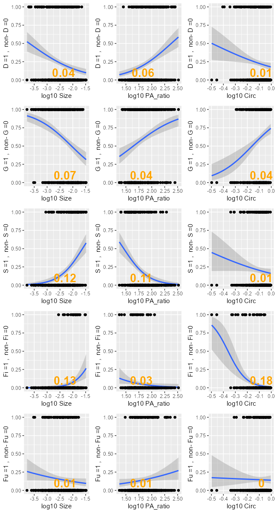

```{r setup, include=FALSE}
knitr::opts_chunk$set(echo = TRUE)
```

```{r}
####LIBRARIES####
library(tidyverse)
library(readr)
library(cowplot)
```

```{r}
##Import data##

pa_data_done <- read_csv("data/pa_data_done.csv")

####CLASS CHECK####
pa_data_done$Shape_Length <- as.numeric(pa_data_done$Shape_Length)
pa_data_done$Shape_Area <- as.numeric(pa_data_done$Shape_Area)
pa_data_done$Survey_times <- as.numeric(pa_data_done$Survey_times)
pa_data_done$Plot_ID <- as.factor(pa_data_done$Plot_ID)
pa_data_done$Fate <- as.factor(pa_data_done$Fate)
pa_data_done$Recruit <- as.factor(pa_data_done$Recruit)

```

# Calculate R square, AIC, LogLik 
```{r}
### Calculate the survival (mortality) separately 

# Calculate R square, AIC, LogLik for 3 morphological classification
R_square <- list()
R_square_bind <- list()
Log_likelihood <- list()
AIC_list <- list()


for (Fates in "D") {
  
pa_data_done$Discrete_change <- ifelse(pa_data_done$Fate == Fates, 1, ifelse(pa_data_done$Fate != Fates, 0, NA))
  pa_data_done_12 <- filter(pa_data_done, Survey_times == 1 | Survey_times == 2)
  
# Clean data
df <- data.frame(pa_data_done_12$Discrete_change, pa_data_done_12$Shape_Area, pa_data_done_12$pa_ratio, pa_data_done_12$circ) 
    colnames(df) <- c(paste(Fates,"=1",", ","non-",Fates,"=0"), "Size","PA_ratio","Circ")

for (i in 1:3) {
  model <- glm(df[[1]] ~ log10(df[[i+1]]), family = binomial)
  R_square[i] <- with(summary(model), 1 - deviance/null.deviance) # Calculate McFadden's R-squared
  Log_likelihood[i] <- logLik(model) # Calculate log likelihood
  AIC_list[i] <- AIC(model) # Calculate AIC
}

## Calculate R square, AIC, LogLik for size*circ and size+circ
# size*circ
model <- glm(df[[1]] ~ log10(df[[2]])*log10(df[[4]]), family = binomial)
R_square[i+1] <- with(summary(model), 1 - deviance/null.deviance) # Calculate McFadden's R-squared
Log_likelihood[i+1] <- logLik(model) # Calculate log likelihood
AIC_list[i+1] <- AIC(model) # Calculate AIC

# size+circ
model <- glm(df[[1]] ~ log10(df[[2]])+log10(df[[4]]), family = binomial)
R_square[i+2] <- with(summary(model), 1 - deviance/null.deviance) # Calculate McFadden's R-squared
Log_likelihood[i+2] <- logLik(model) # Calculate log likelihood
AIC_list[i+2] <- AIC(model) # Calculate AIC

# Bind the lists
R_square_bind  <- rbind(R_square_bind, R_square)
}

### calculate the fates that do not include survival 
Fate_loop <- c("G","S","Fi","Fu")

for (Fates in Fate_loop) {

  pa_data_done$Discrete_change <- ifelse(pa_data_done$Fate == Fates, 1, ifelse(pa_data_done$Fate != Fates, 0, NA))
  pa_data_done_12 <- filter(pa_data_done, Survey_times == 1 | Survey_times == 2)
  pa_data_done_12 <- filter(pa_data_done_12, Fate != "D") #Exclude mortality
  #pa_data_done_12 <- filter(pa_data_done_12, size_class != "J") #Exclude Juvenile
  
  # Clean data
  df <- data.frame(pa_data_done_12$Discrete_change, pa_data_done_12$Shape_Area, pa_data_done_12$pa_ratio, pa_data_done_12$circ) 
    colnames(df) <- c(paste(Fates,"=1",", ","non-",Fates,"=0"), "Size","PA_ratio","Circ")
  
  # Calculate R square, AIC, LogLik for 3 morphological classification
R_square <- list()
for (i in 1:3) {
  model <- glm(df[[1]] ~ log10(df[[i+1]]), family = binomial)
  R_square[i] <- with(summary(model), 1 - deviance/null.deviance) # Calculate McFadden's R-squared
  Log_likelihood[i] <- logLik(model) # Calculate log likelihood
  AIC_list[i] <- AIC(model) # Calculate AIC
}

## Calculate R square, AIC, LogLik for size*circ and size+circ
# size*circ
model <- glm(df[[1]] ~ log10(df[[2]])*log10(df[[4]]), family = binomial)
R_square[i+1] <- with(summary(model), 1 - deviance/null.deviance) # Calculate McFadden's R-squared
Log_likelihood[i+1] <- logLik(model) # Calculate log likelihood
AIC_list[i+1] <- AIC(model) # Calculate AIC

# size+circ
model <- glm(df[[1]] ~ log10(df[[2]])+log10(df[[4]]), family = binomial)
R_square[i+2] <- with(summary(model), 1 - deviance/null.deviance) # Calculate McFadden's R-squared
Log_likelihood[i+2] <- logLik(model) # Calculate log likelihood
AIC_list[i+2] <- AIC(model) # Calculate AIC

# Bind the lists
R_square_bind  <- rbind(R_square_bind, R_square)

}

R_square_bind <- data.frame(lapply(R_square_bind, function(x) unlist(x)))
R_square_bind <- round(R_square_bind, 2)

# 設置列名
colnames(R_square_bind) <- c("Size", "P/A ratio", "Circ", "Size*Circ", "Size+Circ")
# 設置行名
rownames(R_square_bind) <- c("Survival", "Growth", "Shrinkage", "Fission", "Fusion")


R_square_bind <- data.frame(R_square_bind)
R_square_bind <- round(R_square_bind,2)
Log_likelihood <- as.numeric(Log_likelihood)
AIC_list <- as.numeric(AIC_list)


```


# Analyze Survival
```{r}
#####Plot all Fate vs non-Fate lm#########
combined_list <- list()
model_times <- list()
model_plus <- list()

# Calculate the survival (mortality) separately 
Fate_loop <- c("D")

pa_data_done$Discrete_change <- ifelse(pa_data_done$Fate == Fates, 1, ifelse(pa_data_done$Fate != Fates, 0, NA))
  pa_data_done_12 <- filter(pa_data_done, Survey_times == 1 | Survey_times == 2)
  
# Clean data
df <- data.frame(pa_data_done_12$Discrete_change, pa_data_done_12$Shape_Area, pa_data_done_12$pa_ratio, pa_data_done_12$circ) 
    colnames(df) <- c(paste(Fates,"=1",", ","non-",Fates,"=0"), "Size","PA_ratio","Circ")
  
# Calculate R square, AIC, LogLik for 3 morphological classification
R_square <- list()
Log_likelihood <- list()
AIC_list <- list()
for (i in 1:3) {
  model <- glm(df[[1]] ~ log10(df[[i+1]]), family = binomial)
  R_square[i] <- with(summary(model), 1 - deviance/null.deviance) # Calculate McFadden's R-squared
  Log_likelihood[i] <- logLik(model) # Calculate log likelihood
  AIC_list[i] <- AIC(model) # Calculate AIC
}

## Calculate R square, AIC, LogLik for size*circ and size+circ

# size*circ
model <- glm(df[[1]] ~ log10(df[[2]])*log10(df[[4]]), family = binomial)
R_square[i+1] <- with(summary(model), 1 - deviance/null.deviance) # Calculate McFadden's R-squared
Log_likelihood[i+1] <- logLik(model) # Calculate log likelihood
AIC_list[i+1] <- AIC(model) # Calculate AIC

# size+circ
model <- glm(df[[1]] ~ log10(df[[2]])+log10(df[[4]]), family = binomial)
R_square[i+2] <- with(summary(model), 1 - deviance/null.deviance) # Calculate McFadden's R-squared
Log_likelihood[i+2] <- logLik(model) # Calculate log likelihood
AIC_list[i+2] <- AIC(model) # Calculate AIC


R_square <- as.numeric(round(R_square),2)
Log_likelihood <- as.numeric(Log_likelihood)
AIC_list <- as.numeric(AIC_list)
  
#set the position of annotation 
annotation <- data.frame(
    x = c(log10(median(df$Size)),log10(median(df$PA_ratio)),log10(median(df$Circ))),
    y = c(0.1,0.1,0.1)
  )
annotation$R_square <- R_square
  
# Plot discrete change with size, ratio, circ
plot_list <- list()
for (i in 1:3) {
    data <- data.frame(
      x = df[,i+1],
      y = df[,1]
    )
    p <- ggplot(data = data, aes(log10(x), y))+
    geom_point(shape=21)+
    geom_smooth(method="glm", method.args = list(family = "binomial"))+
    geom_point()+ 
    xlab(paste("log10",colnames(df[i+1])))+
    ylab(colnames(df[1]))+ 
    geom_text(data = annotation[i,], aes( x=x, y=y, label=round(R_square, 2)),
                    color="orange", 
                    size=7, fontface="bold" )
    plot_list[[i]] <- p
  }

# Bind the lists
combined_list <- append(combined_list, plot_list)

```


# Analyze Growth
```{r}
# Define the fates that do not include survival 
Fate_loop <- c("G","S","Fi","Fu")

for (Fates in Fate_loop) {

  pa_data_done$Discrete_change <- ifelse(pa_data_done$Fate == Fates, 1, ifelse(pa_data_done$Fate != Fates, 0, NA))
  pa_data_done_12 <- filter(pa_data_done, Survey_times == 1 | Survey_times == 2)
  pa_data_done_12 <- filter(pa_data_done_12, Fate != "D") #Exclude mortality
  #pa_data_done_12 <- filter(pa_data_done_12, size_class != "J") #Exclude Juvenile
  
  # Clean data
  df <- data.frame(pa_data_done_12$Discrete_change, pa_data_done_12$Shape_Area, pa_data_done_12$pa_ratio, pa_data_done_12$circ) 
    colnames(df) <- c(paste(Fates,"=1",", ","non-",Fates,"=0"), "Size","PA_ratio","Circ")
  
  # Calculate R square, AIC, LogLik for 3 morphological classification
R_square <- list()
for (i in 1:3) {
  model <- glm(df[[1]] ~ log10(df[[i+1]]), family = binomial)
  R_square[i] <- with(summary(model), 1 - deviance/null.deviance) # Calculate McFadden's R-squared
}
R_square <- as.numeric(R_square)
  
  #set the position of annotation 
  annotation <- data.frame(
    x = c(log10(median(df$Size)),log10(median(df$PA_ratio)),log10(median(df$Circ))),
    y = c(0.1,0.1,0.1)
  )
  annotation$R_square <- R_square
  
  # Plot discrete change with size, ratio, circ
  plot_list <- list()
  for (i in 1:3) {
    data <- data.frame(
      x = df[,i+1],
      y = df[,1]
    )
    p <- ggplot(data = data, aes(log10(x), y))+
    geom_point(shape=21)+
    geom_smooth(method="glm", method.args = list(family = "binomial"))+
    geom_point()+ 
    xlab(paste("log10",colnames(df[i+1])))+
    ylab(colnames(df[1]))+ 
    geom_text(data = annotation[i,], aes( x=x, y=y, label=round(R_square, 2)),
                    color="orange", 
                    size=7, fontface="bold" )
    plot_list[[i]] <- p
  }

# Bind the lists
combined_list <- append(combined_list, plot_list)
}

```


## Plot GLM and calculate psudo-R square
```{r}
#plot together
fig2_1 <- plot_grid(combined_list[[1]],combined_list[[2]],combined_list[[3]],combined_list[[4]],combined_list[[5]],combined_list[[6]],combined_list[[7]],combined_list[[8]],combined_list[[9]],combined_list[[10]],combined_list[[11]],combined_list[[12]],combined_list[[13]],combined_list[[14]],combined_list[[15]],align="h",nrow = 5)
ggsave("C:/Users/keelu/R/FiFu_analysis/Figs/Discrete_logClass_lm_all.png", plot = fig2_1, width = 6.5, height = 12, dpi = 100)
dev.off()
```


