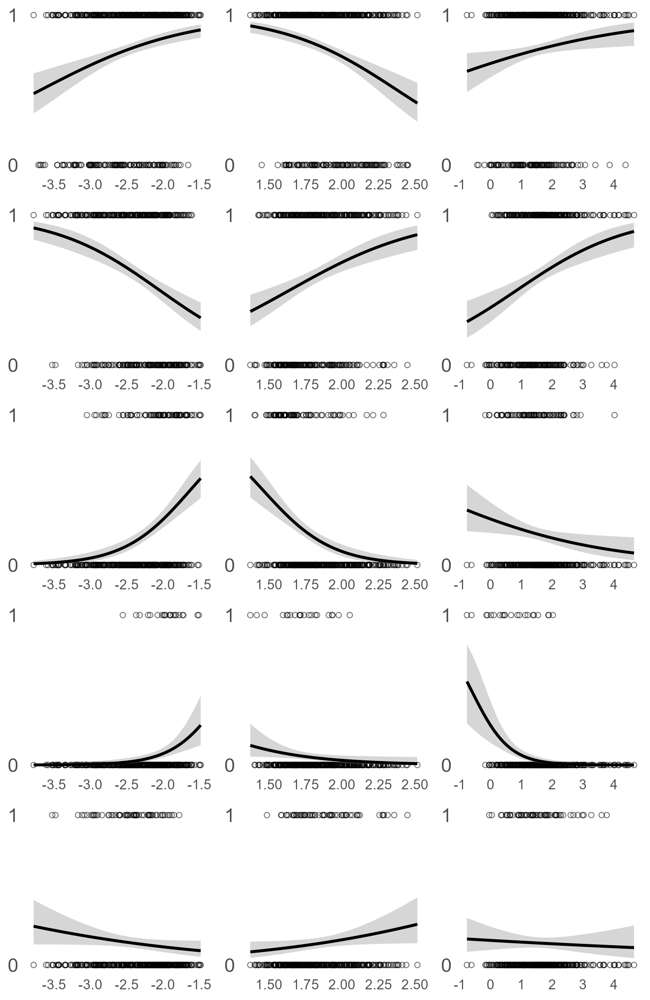

FiFu_All
================
Yan
2023-10-30

    ## Rows: 796 Columns: 15
    ## ── Column specification ────────────────────────────────────────────────────────
    ## Delimiter: ","
    ## chr  (7): Fate, Source, Recruit, Species, Site, Plot_ID, Date
    ## dbl  (7): OBJECTID, ID, Shape_Length, Shape_Area, Year, Month, Survey_times
    ## time (1): Time
    ## 
    ## ℹ Use `spec()` to retrieve the full column specification for this data.
    ## ℹ Specify the column types or set `show_col_types = FALSE` to quiet this message.

    ##     OBJECTID            ID          Shape_Length       Shape_Area       
    ##  Min.   :  0.00   Min.   :  1.00   Min.   :0.05295   Min.   :0.0001652  
    ##  1st Qu.: 32.00   1st Qu.: 38.00   1st Qu.:0.16672   1st Qu.:0.0015725  
    ##  Median : 68.00   Median : 81.50   Median :0.29670   Median :0.0043686  
    ##  Mean   : 74.94   Mean   : 93.75   Mean   :0.32827   Mean   :0.0063659  
    ##  3rd Qu.:112.00   3rd Qu.:134.00   3rd Qu.:0.43638   3rd Qu.:0.0095757  
    ##  Max.   :193.00   Max.   :264.00   Max.   :1.28152   Max.   :0.0330500  
    ##    Fate        Source          Recruit   Species              Site          
    ##  D   :122   Length:796         N:661   Length:796         Length:796        
    ##  Fi  : 21   Class :character   Y:135   Class :character   Class :character  
    ##  Fu  : 59   Mode  :character           Mode  :character   Mode  :character  
    ##  NA's:594                                                                   
    ##                                                                             
    ##                                                                             
    ##  Plot_ID        Year          Month           Date               Time         
    ##  M1 :261   Min.   :2020   Min.   : 1.00   Length:796         Length:796       
    ##  M2 :141   1st Qu.:2020   1st Qu.: 4.00   Class :character   Class1:hms       
    ##  TY3:394   Median :2022   Median :10.00   Mode  :character   Class2:difftime  
    ##            Mean   :2021   Mean   : 8.41                      Mode  :numeric   
    ##            3rd Qu.:2022   3rd Qu.:12.00                                       
    ##            Max.   :2022   Max.   :12.00                                       
    ##   Survey_times  size_class    pa_ratio      Circle_Length          circ       
    ##  Min.   :1.00   A:482      Min.   : 23.60   Min.   :0.04556   Min.   :0.3177  
    ##  1st Qu.:1.00   J:314      1st Qu.: 46.49   1st Qu.:0.14057   1st Qu.:0.7438  
    ##  Median :2.00              Median : 66.99   Median :0.23430   Median :0.8296  
    ##  Mean   :2.01              Mean   : 86.40   Mean   :0.25094   Mean   :0.8075  
    ##  3rd Qu.:3.00              3rd Qu.:109.15   3rd Qu.:0.34689   3rd Qu.:0.8951  
    ##  Max.   :3.00              Max.   :328.47   Max.   :0.64445   Max.   :0.9939

<figure>

<figcaption aria-hidden="true">Fig0</figcaption>
</figure>

# Check composition change with survey times

``` r
#####plot composition difference in 3 survey times
#clean data
df <- data.frame(pa_data$Survey_times, pa_data$pure_size, pa_data$size_class_pa, pa_data$size_class_circ) 
colnames(df) <- c("Survey_times", "Size","P/A ratio","Circularity")

plot_list <- list()
for (i in 1:3) {
  data <- data.frame(
    x = df[,1],
    y = df[,i+1]
  )
  p <- ggplot(data = data, aes(x = x, fill = y, na.rm = TRUE)) +
    geom_bar(position = "fill") +
    xlab("Survey_times") +
    ylab("Proportion of colonies")+ 
    guides(fill=guide_legend(title=colnames(df[i+1])))
  plot_list[[i]] <- p
}

#plot together
fig1 <- plot_grid(plot_list[[1]],plot_list[[2]],plot_list[[3]],align="h",labels=c("A","B","C"),nrow = 1)
ggsave("C:/Users/keelu/R/FiFu_analysis/Figs/times_proportion_fillbox.png", plot = fig1, width = 6, height = 5.3, dpi = 100)
dev.off()
```

    ## null device 
    ##           1

<figure>

<figcaption aria-hidden="true">Fig1</figcaption>
</figure>

# Summarize the finalized data

``` r
summary(pa_data_done)
```

    ##     OBJECTID            ID          Shape_Length       Shape_Area       
    ##  Min.   :  0.00   Min.   :  1.00   Min.   :0.05295   Min.   :0.0001652  
    ##  1st Qu.: 32.00   1st Qu.: 38.00   1st Qu.:0.16672   1st Qu.:0.0015725  
    ##  Median : 68.00   Median : 81.50   Median :0.29670   Median :0.0043686  
    ##  Mean   : 74.94   Mean   : 93.75   Mean   :0.32827   Mean   :0.0063659  
    ##  3rd Qu.:112.00   3rd Qu.:134.00   3rd Qu.:0.43638   3rd Qu.:0.0095757  
    ##  Max.   :193.00   Max.   :264.00   Max.   :1.28152   Max.   :0.0330500  
    ##                                                                         
    ##      Fate              Source          Recruit   Species         
    ##  Length:796         Length:796         N:661   Length:796        
    ##  Class :character   Class :character   Y:135   Class :character  
    ##  Mode  :character   Mode  :character           Mode  :character  
    ##                                                                  
    ##                                                                  
    ##                                                                  
    ##                                                                  
    ##      Site           Plot_ID        Year          Month           Date          
    ##  Length:796         M1 :261   Min.   :2020   Min.   : 1.00   Length:796        
    ##  Class :character   M2 :141   1st Qu.:2020   1st Qu.: 4.00   Class :character  
    ##  Mode  :character   TY3:394   Median :2022   Median :10.00   Mode  :character  
    ##                               Mean   :2021   Mean   : 8.41                     
    ##                               3rd Qu.:2022   3rd Qu.:12.00                     
    ##                               Max.   :2022   Max.   :12.00                     
    ##                                                                                
    ##      Time           Survey_times  size_class    pa_ratio      Circle_Length    
    ##  Length:796        Min.   :1.00   A:482      Min.   : 23.60   Min.   :0.04556  
    ##  Class1:hms        1st Qu.:1.00   J:314      1st Qu.: 46.49   1st Qu.:0.14057  
    ##  Class2:difftime   Median :2.00              Median : 66.99   Median :0.23430  
    ##  Mode  :numeric    Mean   :2.01              Mean   : 86.40   Mean   :0.25094  
    ##                    3rd Qu.:3.00              3rd Qu.:109.15   3rd Qu.:0.34689  
    ##                    Max.   :3.00              Max.   :328.47   Max.   :0.64445  
    ##                                                                                
    ##       circ        pure_size size_class_pa size_class_circ   sa_change       
    ##  Min.   :0.3177   J:314     J :314        J :314          Min.   :-0.02223  
    ##  1st Qu.:0.7438   M:346     IA:332        IA:213          1st Qu.:-0.00175  
    ##  Median :0.8296   L:136     CA:150        CA:269          Median : 0.00079  
    ##  Mean   :0.8075                                           Mean   :-0.00020  
    ##  3rd Qu.:0.8951                                           3rd Qu.: 0.00254  
    ##  Max.   :0.9939                                           Max.   : 0.01359  
    ##                                                           NA's   :270       
    ##   change_rate         rate_ad      
    ##  Min.   : 0.0000   Min.   :0.0000  
    ##  1st Qu.: 0.2557   1st Qu.:0.1924  
    ##  Median : 1.1397   Median :1.1167  
    ##  Mean   : 1.3323   Mean   :1.4036  
    ##  3rd Qu.: 1.7853   3rd Qu.:1.9271  
    ##  Max.   :12.7904   Max.   :8.5269  
    ##  NA's   :270       NA's   :270

# Check normal distributin of multiplier

``` r
####plot histgram to check normal distributin
pa_data_done_12 <-  filter(pa_data_done, Survey_times == 1 | Survey_times == 2)
hist(log(pa_data_done_12$rate_ad))
```

<!-- -->

## Plot GLM and calculate psudo-R square

``` r
#####Plot all Fate vs non-Fate lm#########
combined_list <- list()
model_times <- list()
model_plus <- list()
# Define the fates 
Fate_loop <- c("D","G","S","Fi","Fu")

for (Fates in Fate_loop) {

  pa_data_done$Discrete_change <- ifelse(pa_data_done$Fate == Fates, 1, ifelse(pa_data_done$Fate != Fates, 0, NA))
  pa_data_done_12 <- filter(pa_data_done, Survey_times == 1 | Survey_times == 2)
  #pa_data_done_12 <- filter(pa_data_done_12, size_class != "J") #Exclude Juvenile
  
  # Clean data
  df <- data.frame(pa_data_done_12$Discrete_change, pa_data_done_12$Shape_Area, pa_data_done_12$pa_ratio, pa_data_done_12$circ) 
    colnames(df) <- c(paste(Fates,"=1",", ","non-",Fates,"=0"), "Size","PA_ratio","Circ")
  
  # Calculate R square
R_square <- list()
for (i in 1:3) {
  model <- glm(df[[1]] ~ log10(df[[i+1]]), family = binomial)
  R_square[i] <- with(summary(model), 1 - deviance/null.deviance) # Calculate McFadden's R-squared
}
R_square <- as.numeric(R_square)
  
  #set the position of annotation 
  annotation <- data.frame(
    x = c(log10(median(df$Size)),log10(median(df$PA_ratio)),log10(median(df$Circ))),
    y = c(0.1,0.1,0.1)
  )
  annotation$R_square <- R_square
  
  # Plot discrete change with size, ratio, circ
  plot_list <- list()
  for (i in 1:3) {
    data <- data.frame(
      x = df[,i+1],
      y = df[,1]
    )
    p <- ggplot(data = data, aes(log10(x), y))+
    geom_point(shape=21)+
    geom_smooth(method="glm", method.args = list(family = "binomial"))+
    geom_point()+ 
    xlab(paste("log10",colnames(df[i+1])))+
    ylab(colnames(df[1]))+ 
    geom_text(data = annotation[i,], aes( x=x, y=y, label=round(R_square, 2)),
                    color="orange", 
                    size=7, fontface="bold" )
    plot_list[[i]] <- p
  }

# Bind the lists
combined_list <- append(combined_list, plot_list)
}


#plot together
fig2_1 <- plot_grid(combined_list[[1]],combined_list[[2]],combined_list[[3]],combined_list[[4]],combined_list[[5]],combined_list[[6]],combined_list[[7]],combined_list[[8]],combined_list[[9]],combined_list[[10]],combined_list[[11]],combined_list[[12]],combined_list[[13]],combined_list[[14]],combined_list[[15]],align="h",nrow = 5)
```

    ## `geom_smooth()` using formula = 'y ~ x'
    ## `geom_smooth()` using formula = 'y ~ x'
    ## `geom_smooth()` using formula = 'y ~ x'
    ## `geom_smooth()` using formula = 'y ~ x'
    ## `geom_smooth()` using formula = 'y ~ x'
    ## `geom_smooth()` using formula = 'y ~ x'
    ## `geom_smooth()` using formula = 'y ~ x'
    ## `geom_smooth()` using formula = 'y ~ x'
    ## `geom_smooth()` using formula = 'y ~ x'
    ## `geom_smooth()` using formula = 'y ~ x'
    ## `geom_smooth()` using formula = 'y ~ x'
    ## `geom_smooth()` using formula = 'y ~ x'
    ## `geom_smooth()` using formula = 'y ~ x'
    ## `geom_smooth()` using formula = 'y ~ x'
    ## `geom_smooth()` using formula = 'y ~ x'

``` r
ggsave("C:/Users/keelu/R/FiFu_analysis/Figs/Discrete_logClass_lm_all.png", plot = fig2_1, width = 6.5, height = 12, dpi = 100)
dev.off()
```

    ## null device 
    ##           1

<figure>

<figcaption aria-hidden="true">Fig2</figcaption>
</figure>

# Summarize binomial GLM results

``` r
##### Manually loop trhough fate to get GLM result
# Define the fates 
Fate_loop <- c("D","G","S","Fi","Fu")
Fates <- "Fu"
pa_data_done$Discrete_change <- ifelse(pa_data_done$Fate == Fates, 1, ifelse(pa_data_done$Fate != Fates, 0, NA))
pa_data_done_12 <- filter(pa_data_done, Survey_times == 1 | Survey_times == 2)
#pa_data_done_12 <- filter(pa_data_done_12, size_class != "J") #Exclude Juvenile
  
# Clean data
  df <- data.frame(pa_data_done_12$Discrete_change, pa_data_done_12$Shape_Area, pa_data_done_12$pa_ratio, pa_data_done_12$circ) 
    colnames(df) <- c(paste(Fates,"=1",", ","non-",Fates,"=0"), "Size","PA_ratio","Circ")

# Calculate Size * Circ and Size + Circ
model_t <- glm(data = df, df[[1]] ~ log10(Size)*log10(Circ), family = binomial)
summary(model_t)
```

    ## 
    ## Call:
    ## glm(formula = df[[1]] ~ log10(Size) * log10(Circ), family = binomial, 
    ##     data = df)
    ## 
    ## Coefficients:
    ##                         Estimate Std. Error z value Pr(>|z|)   
    ## (Intercept)               1.1146     1.4378   0.775  0.43823   
    ## log10(Size)               1.2886     0.5681   2.268  0.02331 * 
    ## log10(Circ)              38.5651    13.1200   2.939  0.00329 **
    ## log10(Size):log10(Circ)  15.8839     5.1448   3.087  0.00202 **
    ## ---
    ## Signif. codes:  0 '***' 0.001 '**' 0.01 '*' 0.05 '.' 0.1 ' ' 1
    ## 
    ## (Dispersion parameter for binomial family taken to be 1)
    ## 
    ##     Null deviance: 369.28  on 525  degrees of freedom
    ## Residual deviance: 357.09  on 522  degrees of freedom
    ## AIC: 365.09
    ## 
    ## Number of Fisher Scoring iterations: 5

``` r
model_p <- glm(data = df, df[[1]] ~ log10(Size)+log10(Circ), family = binomial)
model_plus <- append(model_plus, model_p)
summary(model_p)
```

    ## 
    ## Call:
    ## glm(formula = df[[1]] ~ log10(Size) + log10(Circ), family = binomial, 
    ##     data = df)
    ## 
    ## Coefficients:
    ##              Estimate Std. Error z value Pr(>|z|)   
    ## (Intercept) -2.611051   0.794892  -3.285  0.00102 **
    ## log10(Size) -0.221056   0.284871  -0.776  0.43776   
    ## log10(Circ) -0.003812   1.904541  -0.002  0.99840   
    ## ---
    ## Signif. codes:  0 '***' 0.001 '**' 0.01 '*' 0.05 '.' 0.1 ' ' 1
    ## 
    ## (Dispersion parameter for binomial family taken to be 1)
    ## 
    ##     Null deviance: 369.28  on 525  degrees of freedom
    ## Residual deviance: 368.63  on 523  degrees of freedom
    ## AIC: 374.63
    ## 
    ## Number of Fisher Scoring iterations: 4

# Compare areal proportion differences

``` r
# Clean data
pa_data_done_12 <- filter(pa_data_done, Survey_times == 1 | Survey_times == 2)
df <- data.frame(pa_data_done_12$Fate, pa_data_done_12$pure_size, pa_data_done_12$size_class_pa, pa_data_done_12$size_class_circ) 
colnames(df) <- c("Fate", "Size","P/A ratio","Circularity")

# Plot the proportin of Fate from J, IA, CA
plot_list <- list()
for (i in 1:3) {
  data <- data.frame(
    x = df[,i+1],
    y = df[,1]
  )
  p <- ggplot(data = data, aes(x = x, fill = y,na.rm = TRUE)) + 
  geom_bar(position = "fill") +
  xlab(colnames(df[i+1])) + 
  ylab("Proportion of Fates")+
  geom_text(
      aes(label = signif(after_stat(count) / tapply(after_stat(count), after_stat(x), sum)[as.character(after_stat(x))], digits = 2)),
      stat = "count",
      position = position_fill(vjust = 0.5)
    )
  plot_list[[i]] <- p
  }
fig3 <- plot_grid(plot_list[[1]],plot_list[[2]],plot_list[[3]],align="h",labels=c("A","B","C"),nrow = 1)
ggsave("C:/Users/keelu/R/FiFu_analysis/Figs/Proportion_Fates.png", plot = fig3, width = 8, height = 5.3, dpi = 100)

# Plot the proportin of Fate from J, IA, CA. Reverse X Y
plot_list <- list()
for (i in 1:3) {
  data <- data.frame(
    x = df[,1],
    y = df[,i+1]
  )
  p <- ggplot(data = data, aes(x = x, fill = y,na.rm = TRUE)) + 
  geom_bar(position = "fill") +
  xlab(colnames(df[i+1])) + 
  ylab("Proportion of Fates")+
  geom_text(
      aes(label = signif(after_stat(count) / tapply(after_stat(count), after_stat(x), sum)[as.character(after_stat(x))], digits = 2)),
      stat = "count",
      position = position_fill(vjust = 0.5)
    )
  plot_list[[i]] <- p
  }
fig3_1 <- plot_grid(plot_list[[1]],plot_list[[2]],plot_list[[3]],align="h",labels=c("A","B","C"),nrow = 1)
ggsave("C:/Users/keelu/R/FiFu_analysis/Figs/Proportion_Fates_Revers.png", plot = fig3_1, width = 8.8, height = 5.3, dpi = 100)
#fig3_1

# Plot the proportin of Fate from J, IA, CA. Reverse X Y without J
pa_data_done_12 <- filter(pa_data_done, Survey_times == 1 | Survey_times == 2)
pa_data_done_12 <- filter(pa_data_done_12, size_class != "J")
df <- data.frame(pa_data_done_12$Fate, pa_data_done_12$pure_size, pa_data_done_12$size_class_pa, pa_data_done_12$size_class_circ) 
colnames(df) <- c("Fate", "Size","P/A ratio","Circularity")
plot_list <- list()
for (i in 1:3) {
  data <- data.frame(
    x = df[,1],
    y = df[,i+1]
  )
  p <- ggplot(data = data, aes(x = x, fill = y,na.rm = TRUE)) + 
  geom_bar(position = "fill") +
  xlab(colnames(df[i+1])) + 
  ylab("Proportion of Fates")+
  geom_text(
      aes(label = signif(after_stat(count) / tapply(after_stat(count), after_stat(x), sum)[as.character(after_stat(x))], digits = 2)),
      stat = "count",
      position = position_fill(vjust = 0.5)
    )
  plot_list[[i]] <- p
  }
fig3_2 <- plot_grid(plot_list[[1]],plot_list[[2]],plot_list[[3]],align="h",labels=c("A","B","C"),nrow = 1)
ggsave("C:/Users/keelu/R/FiFu_analysis/Figs/Proportion_Fates_Revers_NoJ.png", plot = fig3_2, width = 10.5, height = 3.8, dpi = 100)
```

<figure>

<figcaption aria-hidden="true">Fig3</figcaption>
</figure>

# Compare multiplier difference

``` r
### Plot mean multiplier difference
# Clean data, remove J due to all the same
pa_data_done_12 <- filter(pa_data_done, Survey_times == 1 | Survey_times == 2 )
pa_data_done_12 <- filter(pa_data_done_12, size_class == "A")
df <- data.frame(pa_data_done_12$Fate, pa_data_done_12$pure_size, pa_data_done_12$size_class_pa, pa_data_done_12$size_class_circ, pa_data_done_12$rate_ad) 
colnames(df) <- c("Fate", "Size","PA_ratio","Circularity","Multiplier")

# Plot the multiplier data range
plot_list <- list()
for (i in 1:3) {
  data <- data.frame(
    x = df[,1],
    y = df[,i+1],
    z = df[,5]
  )
  # Calculating both the mean and standard deviation
  result <- data %>%
  group_by(x, y) %>%
  summarise(
    Means = mean(z),
    SDs = sd(z)
  )
  p <- ggplot(result, aes(x = x, y = Means, fill = y)) +
  geom_bar(stat = "identity", position = position_dodge()) +
  geom_errorbar(aes(ymin = Means - SDs, ymax = Means + SDs), position = position_dodge(width = 0.9), width = 0.25) +
  labs(x = "Fate", y = "Multiplier", fill = colnames(df[i+1])) +
  theme_minimal()
  plot_list[[i]] <- p
}
```

    ## `summarise()` has grouped output by 'x'. You can override using the `.groups`
    ## argument.
    ## `summarise()` has grouped output by 'x'. You can override using the `.groups`
    ## argument.
    ## `summarise()` has grouped output by 'x'. You can override using the `.groups`
    ## argument.

``` r
fig4_1 <- plot_grid(plot_list[[1]],plot_list[[2]],plot_list[[3]],align="h",labels=c("A","B","C"),nrow = 1)
ggsave("C:/Users/keelu/R/FiFu_analysis/Figs/Multiplier_Fates_boxplot_NoJ.png", plot = fig4_1, width = 10.5, height = 3.8, dpi = 100)
```

<figure>

<figcaption aria-hidden="true">Fig4</figcaption>
</figure>

# Compare the difference of three methods

``` r
### Plot method comparison
method_compare <- read_csv("data/Method_compare.csv")
```

    ## Rows: 126 Columns: 5
    ## ── Column specification ────────────────────────────────────────────────────────
    ## Delimiter: ","
    ## chr (3): Fate, Stage, Method
    ## dbl (2): prop_area, multiplier
    ## 
    ## ℹ Use `spec()` to retrieve the full column specification for this data.
    ## ℹ Specify the column types or set `show_col_types = FALSE` to quiet this message.

``` r
### Plot mean multiplier difference
stage_loop <- c("J","I","C")
# Define the custom order
custom_order <- c("GJ","GI","GC","SJ","SI","SC","FiJ","FiI","FiC","FuJ","FuI","FuC","rec","mort")
method_compare$Fate <- factor(method_compare$Fate, levels = custom_order)

# Plot the multiplier difference in three methods
plot_list <- list()
for (i in 1:3) {
  df <- filter(method_compare, Stage == stage_loop[i])
  p <- ggplot(df, aes(x = Fate, y = multiplier, fill = Method)) +
  geom_bar(stat = "identity", position = position_dodge()) +
  labs(x = stage_loop[i], y = "Multiplier", fill = "Method") +
  theme_minimal()
  plot_list[[i]] <- p
}

fig5_1 <- plot_grid(plot_list[[1]],plot_list[[2]],plot_list[[3]],align="h",labels=c("A","B","C"),nrow = 1)
ggsave("C:/Users/keelu/R/FiFu_analysis/Figs/Method_compare_m.png", plot = fig5_1, width = 17.3, height = 3.6, dpi = 100)
#fig5_1


# Plot the Areal proportion difference in three methods
plot_list <- list()
for (i in 1:3) {
  df <- filter(method_compare, Stage == stage_loop[i])
  p <- ggplot(df, aes(x = Fate, y = prop_area, fill = Method)) +
  geom_bar(stat = "identity", position = position_dodge()) +
  labs(x = stage_loop[i], y = "Areal proportion", fill = "Method") +
  theme_minimal()
  plot_list[[i]] <- p
}

fig5_2 <- plot_grid(plot_list[[1]],plot_list[[2]],plot_list[[3]],align="h",labels=c("A","B","C"),nrow = 1)
ggsave("C:/Users/keelu/R/FiFu_analysis/Figs/Method_compare_a.png", plot = fig5_2, width = 17.3, height = 3.6, dpi = 100)
#fig5_2

# Plot the Areal proportion X multiplier difference in three methods
method_compare$aXm <- NA
method_compare$aXm <- method_compare$prop_area * method_compare$multiplier
plot_list <- list()
for (i in 1:3) {
  df <- filter(method_compare, Stage == stage_loop[i])
  p <- ggplot(df, aes(x = Fate, y = aXm, fill = Method)) +
  geom_bar(stat = "identity", position = position_dodge()) +
  labs(x = stage_loop[i], y = "Areal x Multiplier", fill = "Method") +
  theme_minimal()
  plot_list[[i]] <- p
}

fig5_3 <- plot_grid(plot_list[[1]],plot_list[[2]],plot_list[[3]],align="h",labels=c("A","B","C"),nrow = 1)
ggsave("C:/Users/keelu/R/FiFu_analysis/Figs/Method_compare_aXm.png", plot = fig5_3, width = 16, height = 5, dpi = 100)
```

<figure>

<figcaption aria-hidden="true">Fig5</figcaption>
</figure>

# revising the old code, haven’t finished (want to calculate three methods in a loop)

``` r
########### Calculate multiplier

# Define the custom order
custom_order_1 <- c("GJ","GM","GL","SJ","SM","SL","FiJ","FiM","FiL","FuJ","FuM","FuL","D")
custom_order_2 <- c("GJ","GI","GC","SJ","SI","SC","FiJ","FiI","FiC","FuJ","FuI","FuC","D")


### Calculate mean change rate (multiplier) in each stage
dynamics_df_J <- filter(dynamics_df, stage == "J" )
dynamics_df_IA <- filter(dynamics_df, stage == "M") 
dynamics_df_CA <- filter(dynamics_df, stage == "L")


change_ratio_J <- dynamics_df_J %>%
  group_by(dynamic) %>%
  summarize(mean_x = mean(rate_ad), count = n())
# Convert the Name column to a factor with the custom order
change_ratio_J$dynamic <- factor(change_ratio_J$dynamic, levels = custom_order_1)
# Arrange the tibble based on the custom order
change_ratio_J <- change_ratio_J %>%
  arrange(dynamic)

change_ratio_IA <- dynamics_df_IA %>%
  group_by(dynamic) %>%
  summarize(mean_x = mean(rate_ad), count = n())
# Convert the Name column to a factor with the custom order
change_ratio_IA$dynamic <- factor(change_ratio_IA$dynamic, levels = custom_order_1)
# Arrange the tibble based on the custom order
change_ratio_IA <- change_ratio_IA %>%
  arrange(dynamic)

change_ratio_CA <- dynamics_df_CA %>%
  group_by(dynamic) %>%
  summarize(mean_x = mean(rate_ad), count = n())
# Convert the Name column to a factor with the custom order
change_ratio_CA$dynamic <- factor(change_ratio_CA$dynamic, levels = custom_order_1)
# Arrange the tibble based on the custom order
change_ratio_CA <- change_ratio_CA %>%
  arrange(dynamic)

change_ratio_J
```

    ## # A tibble: 9 × 3
    ##   dynamic mean_x count
    ##   <fct>    <dbl> <int>
    ## 1 GJ       3.32     46
    ## 2 GM       3.24     53
    ## 3 GL       3.00      1
    ## 4 SJ       0.668    10
    ## 5 FiM      2.26      1
    ## 6 FuJ      2.95      3
    ## 7 FuM      1.79     12
    ## 8 FuL      2.60      7
    ## 9 D        0        68

``` r
change_ratio_IA
```

    ## # A tibble: 10 × 3
    ##    dynamic mean_x count
    ##    <fct>    <dbl> <int>
    ##  1 GM       1.74     86
    ##  2 GL       1.73     27
    ##  3 SJ       0.395    11
    ##  4 SM       0.949    25
    ##  5 FiJ      0.575     5
    ##  6 FiM      0.914     4
    ##  7 FuJ      0.563     1
    ##  8 FuM      1.28      9
    ##  9 FuL      1.68     23
    ## 10 D        0        46

``` r
change_ratio_CA
```

    ## # A tibble: 10 × 3
    ##    dynamic mean_x count
    ##    <fct>    <dbl> <int>
    ##  1 GL       1.31     28
    ##  2 SJ       0.135     2
    ##  3 SM       0.483    18
    ##  4 SL       0.825    17
    ##  5 FiJ      0.444     4
    ##  6 FiM      0.612     6
    ##  7 FiL      0.836     1
    ##  8 FuM      0.559     1
    ##  9 FuL      1.73      3
    ## 10 D        0         8
